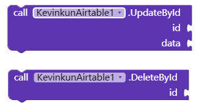
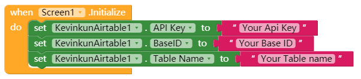
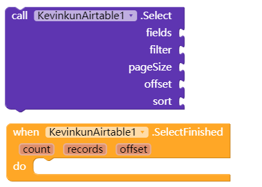
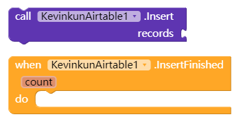
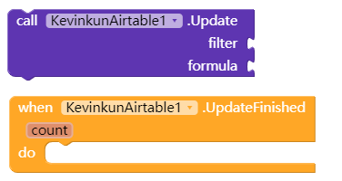
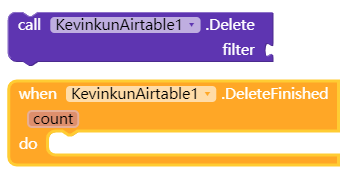

# AirTable extension

Why another extension about Airtable? Because this one is different. This one can select/ insert/ update/ delete according to your filter/condition.

<!--more-->

# Release history

## V2 Update history 2020/12/24

1. fix bug of "can not update value with space", now in the formula, use " and " to quote the value with space.
2. add perperty of FetchIdAndTime. if set to true, in the SelectFinished event you will get 'id' and 'createdTime' for each record.

3. add method 'UpdateById' and 'DeleteById' for update or delete one record, which is faster than by filter.

# all the blocks

## Initialize the extension

Same like other Airtable component, get your API Key, BaseId, TableName from the airtable website.

**update on 13/02/2024
Since 01/01/2024, Airtable deprecated ApiKey, and suggest to use token. You can set the ApiKey to the token, this extension still working.**

## Select records

**fields:** String. or called "column names", Format like "*name,age,phone*". Leave it blank for all fields

**filter**: String. condition the records have to fit. Format like "*age>30*"  or "*OR(age>20, age<50)*". For more info, please refer to [here](https://support.airtable.com/hc/en-us/articles/203255215-Formula-Field-Reference)

**pageSize**: Number. how much records returned one time..  Max value 100.

**offset**: String.  If the records fit the filter more than pageSize, you will get an  offset at SelectFinished event, use it here for more records.

**sort**: String. the records will be ordered on this field. Format like "age desc" or "age asc"

**count**: Number. how much records selected.

**records**: String. Json format. it's a json array of dictionaries. 

## Insert records

**records**:  String. Json format. it's a json array of dictionaries. Format like *[{"name":"Jasmine Lake","age":43,"phone":"513937"}, {"name":"Ava Sharp","age":21,"phone":"293309"}]*

**IMPORTANT**: If you want to feed this param with List component, remember to check "Show List As Json" at Screen1 Properties panel.

**count**: Number. how much records inserted. if count=0, means no records inserted.

## Update records

**filter**: pls refer to Select part
**NOTE**: ONLY up to 10 records will be updated. if more than 10 records fit the filter, there will be Error Cccured.

**formula**:String. How to change the data. Format like: *"age += 1*". there are spaces before and after the “+=”。 Now the accepted operators are +=，-=, \*=, /=, = for number field, and *to* for string field.

**count**: Number. how much records updated. if count=0, means no records updated.

## Delete records

**filter**: pls refer to Select part
**NOTE**: ONLY up to 10 records will be deleted. if more than 10 records fit the filter, there will be Error Cccured.

**count**: Number. how much records deleted. if count=0, means no records deleted

## Error Occurred

**message**: String. Error reason.

# Download link here

[cn.kevinkun.KevinkunAirtable.aix](./images/20250303_133229.aix)
