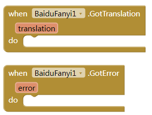

# 百度翻译扩展

使用百度云的接口进行翻译。

<!--more-->

## 方法

textToTranslate：待翻译的文字，语言种类自动识别。

languageToTranslateTo：需要翻译到的语言，可以是zh,en,jp,fra,it等等，具体参看[这里](https://api.fanyi.baidu.com/product/113)

## 事件

- 成功事件：返回1个参数 translation文本
- 失败事件：返回1个参数error文本型

## 属性

* 属性描述：设置appid
  
  

* 属性描述：设置appkey
  
  

## 下载

[cn.kevinkun.KevinkunBaiduFanyi.aix](./images/cn.kevinkun.baidufanyi.aix)
