# CompCreator动态组件扩展

在应用运行期间，使用代码动态的生成可视组件并设置属性，不需要提前在设计界面拖入很多组件。

# Credit:

This extension is inspired on the fabulous work of Yusuf Cihan: [GitHub - ysfchn/DynamicComponents-AI2](https://github.com/ysfchn/DynamicComponents-AI2)

# 所有功能块

## 创建组件

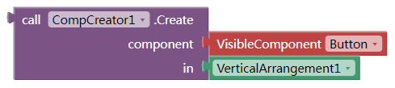

component：是要创建的组件的类型（文本字串），这里推荐使用选项下拉框输入.

in：是新组件的父容器，需要是个容器类组件。

**Known issue:**

The dynamic component will not be listed by "*Every Component*", which is newly added in MIT AI2 2.66.  
But you can use the ListComponents function of this extension.

## 组件列表

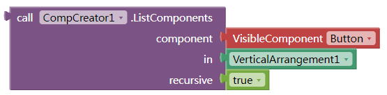

可以返回同类型的组件列表  
recursive: boolean. If true, it will return all components with same type. If false, it will return only the direct children.  

## 移除组件

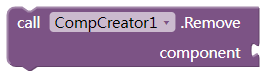

component：要删除的组件，而不是他的类型。如果他是容器类，他的所有子组件也会被移除。

## 设置属性

这个块的大部分功能可以使用内置的任意组件块来实现。  
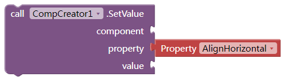

component：要设置属性的组件

property：要设置的组件的属性。可以是以下3种情况:

1. 可以是组件的自带的属性，必须是英文（推荐使用下拉框输入）；
2. 可以是“index”，用来设置组件的排列顺序；
3. 可以是其他自定义的属性，比如id，parent之类的任意文本，中英皆可。相当于附在组件上的一个字典（键值对）。

value：新的属性值

## 获取属性

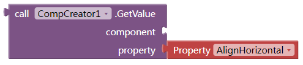

这个块的大部分功能可以使用内置的任意组件块来实现。

## 获取子组件列表和父组件

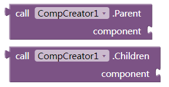

~~只适用于获取动态生成的子组件列表或他的父组件~~

从8.4版本以后，可以支持所有组件（动态的或者手动添加的）获取子组件和父组件。

已知问题：在伴侣中获取Screen的子部件会返回错误的列表。apk中没有问题。

## 从模板创建

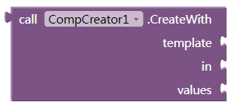

返回值是创建的最外层的容器组件

template: json字符串，创建一组组件需要的模板文本。

in: 容器组件

values: 列表。传入组件模板的值。

可以根据以下格式手动编写，或者在MIT服务器上的设计界面手动添加需要的界面（一条记录），根据需要设置相应的组件属性。选中最外层组件，键盘上按下Ctrl + C，然后在任何文本编辑器里面按键盘上的Ctrl+V，就可以得到模板了  


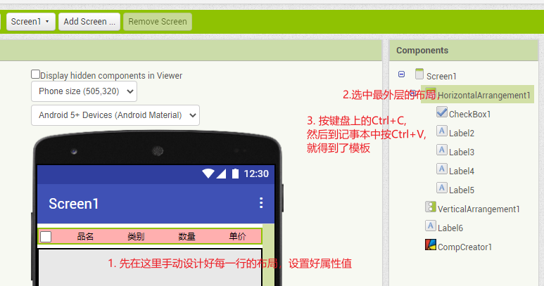

```json
{
  "$components": [
    {
      "$Name": "VerticalArrangement1",
      "$Type": "VerticalArrangement",
      "$Version": "4",
      "Uuid": "-444056707",
      "$Components": [
        {
          "$Name": "Button2",
          "$Type": "Button",
          "$Version": "7",
          "Text": "Text for Button2",
          "TextColor": "&HFFFF00FF",
          "Uuid": "12991510"
        }
      ]
    }
  ],
  "$blocks": []
}
```

以下模板中的\$Name,\$Version,Uuid,\$blocks几个键是从mit自动转换来的，模板中并不需要。你可以把它们删掉，也可以保留，扩展会自动忽略他们。

\$Components 和$Type是必须保留的。

如果你想在运行时替换模板中的属性值，可以像下图这样，替换成{1}, {2}, {3}...这样。  

```json
{
  "$components": [
    {
      "$Name": "VerticalArrangement1",
      "$Type": "VerticalArrangement",
      "$Version": "4",
      "Uuid": "-444056707",
      "$Components": [
        {
          "$Name": "Button2",
          "$Type": "Button",
          "$Version": "7",
          "Text": "{1}",
          "TextColor": "{2}",
          "Uuid": "12991510"
        }
      ]
    }
  ],
  "$blocks": []
}
```

然后这样使用模板,新生成的按钮就可以有新的文本和颜色了：  


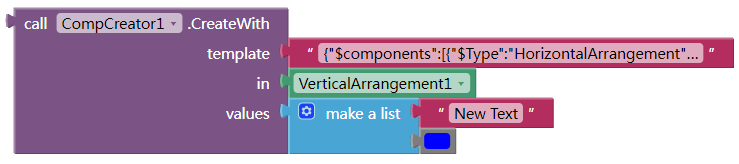

## 添加删除点击事件

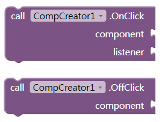

为新建组件添加或取消点击事件。

listener: 过程名。需要手动创建一个过程名，包含一个参数，该参数即为被点击的组件。


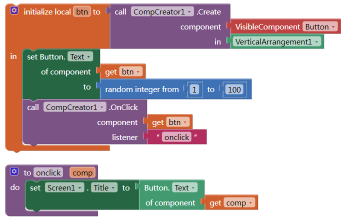

# 下载地址：

扩展aix：  
[cn.kevinkun.CompCreator-V8.9.aix](./images/20250303_115647.aix)

示例aia:  
[compcreator-listview-by-template.aia](./images/20250303_115726.aia)  

更多示例及用法，可以[参考这里](https://community.appinventor.mit.edu/t/free-compcreator-create-component-dynamically/49724)
