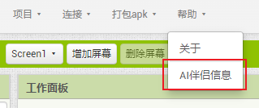
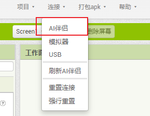
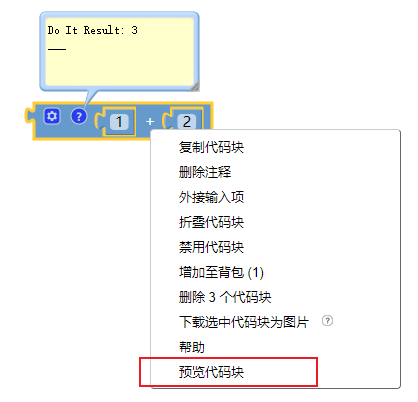
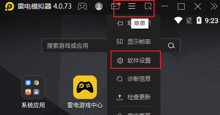
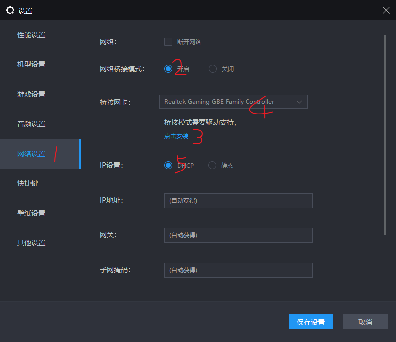

# AI2中如何调试应用

应用开发过程中，调试是必不可少的步骤。很多同学每次代码有点变动，就整个项目编译成apk安装到手机上进行调试，这是不对的。不仅费时费事，而且增加了编译服务器的压力。App Inventor提供了AI伴侣，让我们可以实时的调试。

<!--more-->

# 有哪些调试方式

要调试代码，首先需要将手机与开发服务器连接。AI提供了3种连接方式：AI伴侣、模拟器、USB模式。其中模拟器是使用系统自带的内置模拟器。这个模拟器版本较老，运行缓慢，不推荐。USB模式需要安装手机驱动，也不是很方便。推荐使用AI伴侣来调试代码。

# 手机安装AI伴侣调试

1. 通过帮助-Ai伴侣信息，弹出AI伴侣的下载链接二维码。
2. 手机扫描二维码，下载并安装AI伴侣。
3. 打开运行AI伴侣。第一次运行可能需要权限许可。

# 手机连接服务器

1. 依次打开 连接-AI伴侣，弹出连接码。
2. 使用AI伴侣扫描二维码（或手动输入连接码），等他同步素材、扩展，显示app界面就是连接成功了。

# 预览代码块

1. AI伴侣连接成功后，就可以调试了。我们在设计界面的每次改动，都会实时的反映在AI伴侣中。
2. 如果想知道当前某个（全局）变量的值，可以在变量块上右键，预览代码块，就可以在代码块的注释中看到结果了。（没有连接AI伴侣时，预览代码块是灰色的，无法执行）
3. 注意这里只能预览全局变量，不能预览局部变量。当然也可以预览运行一段代码（过程）
4. 如果想知道局部变量的值，可以将他赋值给某个标签的文本，这样运行时就看到这个值的变化了。

# 电脑安装安卓模拟器 运行AI伴侣

1. 如果手机不在身边又想调试，可以在电脑上安装安卓模拟器，在模拟器内安装AI伴侣来调试。

2. 安卓模拟器有非常多，推荐使用雷电模拟器。

3. 打开AI伴侣后，显示的ip地址可能跟你电脑的本地ip不在一个段，这样就没法连接。需要做如下设置：

4. 打开软件设置：

5. 

6. 开启网络桥接模式，安装相应驱动。安装3完成后请重启模拟器。否则4的位置不出现相关的网卡，ip设置设为DHCP就可以。
   

7. 这样打开AI伴侣，显示的ip地址跟电脑就在一个ip段了（一般是192.168....）。

8. 开发界面，打开连接菜单，AI伴侣，将连接码输入ai伴侣，连接后就可以愉快的开发了。

# 几个注意事项

1. 服务器页面刷新或者更换语言后需要重新连接AI伴侣。
2. 扩展插件升级后需要重新连接AI伴侣。