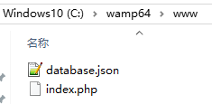
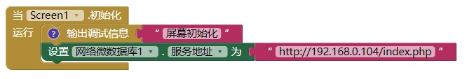

# 自建网络微数据库后台

系统自带网络微数据库使用国外的服务器，速度太慢？数据存在别人服务器上，不安全？下面介绍自己搭建简单的网络微数据库后端。不用复杂的mySQL知识。

<!--more-->

# 准备工作

首先你要有自己的服务器，可以把相关文件上传，服务器要支持php。

下载文件[myTinyWebDB.zip](./images/20250303_132410.zip)，解压，上传到你的服务器。

我是在本机测试（win10+wamp64），文件结构如下：


index.php文件内容如下：

```php
<?php

    header("Content-Type: application/json");
    $file = "database.json";

    if ($_SERVER['REQUEST_METHOD'] != "POST" || !isset($_REQUEST['tag'])) {
        die("Bad Request");
    }

    if (isset($_REQUEST['value'])){

        $tag = trim($_REQUEST['tag']);
        $value = trim($_REQUEST['value']);

        $f = fopen($file, 'r');
        $data = fgets($f);
        fclose($f);

        $parsedData = json_decode($data, true);
        $parsedData[$tag] = $value;

        $f = fopen($file, 'w') or die("Can't open file");
        fwrite($f, json_encode($parsedData));
        fclose($f);

        $result = array("STORED", $tag, $value);
        echo json_encode($result);

    }else{

        $tag = trim($_REQUEST['tag']);

        $f = fopen($file, 'r');
        $data = json_decode(fgets($f), true);
        fclose($f);

        if(isset($data[$tag])){
            $result = array("VALUE", $tag, $data[$tag]);
        }else{
            $result = array("VALUE", $tag, "");
        }
        echo json_encode($result);

    }
?>
```

database.json文件内容如下(只有一对括号)：

```
{}
```

这里需要注意：
**必须给予database.json文件写权限，否则无法保存数据。**
感谢@XM提醒。

好了，运行你的服务器，在浏览器中输入http://你的网址/index.php,回车，如果返回“Bad Request”，说明设置成功。

# 逻辑设计

![2023-05-10T04:54:29.png][3]

这里192.168.0.104是我本机的ip，你要换成你自己的服务器地址。

ok，网络微数据库就可以跟以前一样使用了。