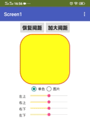
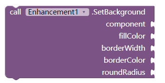
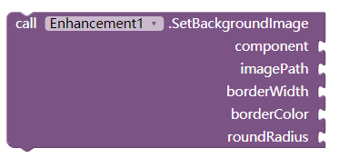
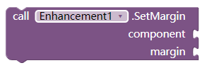
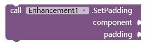
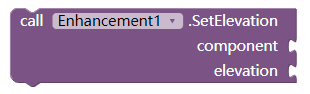
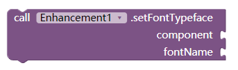

# Enhance界面增强扩展

可以设置组件的背景色、背景图像、边框、圆角矩形、外边距、内边距、高程、使用自定义字体等

<!--more-->

# 示例截图

实时调整布局外观(感谢ldtxinkai提供截图)

# 属性块

## 设置背景颜色及圆角

背景颜色fillColor、边框宽度borderWidth、边框颜色borderColor、圆角半径roundRadius。

"圆角半径可以是一个数字（同时设置四个角），或者是四个数字用逗号隔开（顺时针分别设置左上、右上、右下、左下）。

## 设置背景图片及圆角

背景图片imagePath、边框宽度borderWidth、边框颜色borderColor、圆角半径roundRadius。

imagePath：以//开始表明是素材，以/sdcard/开始表明是在外部存储卡。

"圆角半径可以是一个数字（同时设置四个角），或者是四个数字用逗号隔开（顺时针分别设置左上、右上、右下、左下）。

## 设置外边距

设置组件的外边距margin。外边距可以是一个数字（同时设置四个方向），或者是四个数字用逗号隔开（分别设置左、上、右、下）。

## 设置内边距

设置组件的内边距padding。内边距可以是一个数字（同时设置四个方向），或者是四个数字用逗号隔开（分别设置左、上、右、下）。

## 设置高程

设置组件的高程elevation。会在组件周围显示阴影效果（必须提前设置背景）

## 设置自定义字体

设置组件字体。fontName字体名以//开始表明字体在素材库，以/sdcard/开始表明在外部存储卡。

# 其他

组件component那里不仅可以接布局，还可以接标签、按钮等。更多可能等你去发现~~~

# 下载链接

[cn.kevinkun.KevinkunEnhance.aix](./images/20250303_120235.aix)
