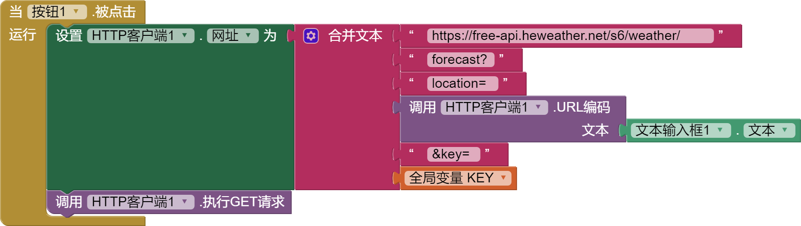
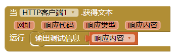
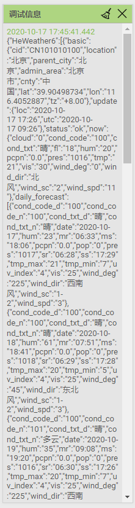
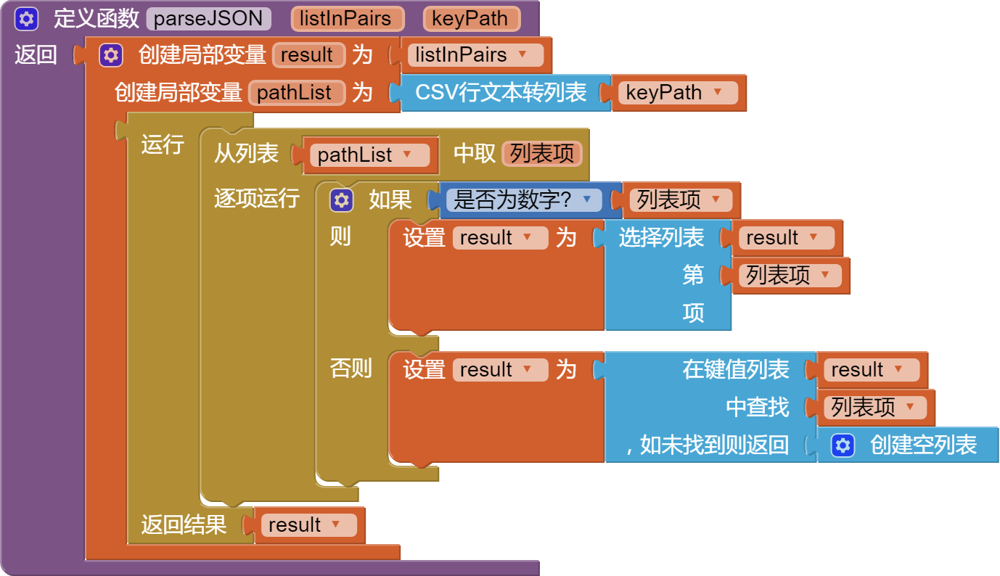
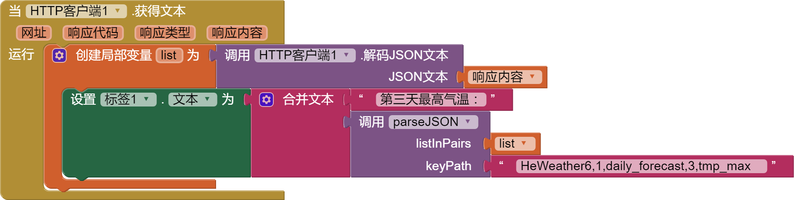
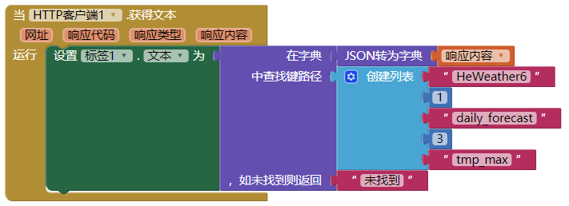

# 获取和风天气

应用与外界交互，使用api接口是最常见的。现在利用wxbit解释下如何获取和风天气的天气预报api。

<!--more-->

# 准备工作

1. 和风天气网站(https://www.heweather.com)注册账号。
2. 进入控制台，应用管理，新建应用。（貌似免费用户只能建一个免费账号。）
3. 记住应用的key。

# 组件设计

组件设计界面，拖入3个可视组件：文本输入框、按钮、标签，1个非可视组件：http客户端。（这个是wxbit服务器新改名的组件，赞一个。原名叫web服务器，翻译的有些不知所云）

这里就不放组件设计图了，太简单了。主要是介绍原理，如何美化应用不在这里讨论。

# 逻辑设计

要使用api接口，就必须要看api接口文档。重要的事说3遍，**看文档~~** **看文档~~** **看文档~~**

我们打开这个文档（<https://dev.heweather.com/docs/api/weather>），有几个关键的点要看到：

1. 获取方式：GET 方式

2. 数据格式： JSON，这里是说返回的数据是JSON格式，就是键值对格式。

3. 免费版的请求URL: `https://free-api.heweather.net/s6/weather/{weather-type}?{parameters}` 花括号中的东西就是我们要按我们的要求替换的，连带花括号也要换掉。

4. weather-type参数，我们这里选forecast， 就是获取未来3天的数据

5. parameters参数，就是我们要告诉接口的请求参数，这里有location就是城市名称，中文或者拼音都可以，key就是准备工作中记下的key。

我们现在开始来获取这个api，看看有什么返回值：

1. 初始化一个变量，记录key
   

2. 构造请求URL
   
   
   特别注意的就是url网址中的forecast后面有个`?`， key前面有个`&`。 
   
   ？用来分割主url和后面的参数，&是用来分割多个参数。而每个参数都是形如`参数名=参数值`这样的。
   
   设置好网址，就可以执行GET请求（还记得上面说的获取方式是GET吧）。

3. 因为关系到网络的传输，速度不确定，所以get请求这个动作，有个异步的`HTTP客户端.获得文本`这个事件，我们就用它来接受返回的结果,并显示在调试窗口。
   

现在就可以连接手机，在文本框中填入城市名称，运行app看看返回值如何。（尽管文档中明确说参数如果是中文的，需要进行url编码，但是这里我们直接输入中文城市名，貌似也可以）

在设计界面右侧的调试信息窗口，显示如图：


哇~~什么鬼？密密麻麻的。其实这就是返回的json字符串了。

如果你的显示跟我的相差很多，比如像这样很短的：`{"HeWeather6":[{"status":"invalid param"}]}`， 说明你的参数设置有误，请检查key是不是有错误，url是不是拼接错误，也有可能是你的每月免费额度用完了。这里是具体的状态码的意义（https://dev.heweather.com/docs/refer/status-code）。

# 解析返回值

这里推荐一个网站，<http://www.bejson.com/> 这个网站可以将json字串格式化，方便我们看清层级关系。

将调试窗口的信息复制（那个时间戳不要复制），在这个网站进行格式化。

格式化后的json字符串格式如下(数据太长了，后面省略一部分)：

```
{
    "HeWeather6": [{
        "basic": {
            "cid": "CN101010100",
            "location": "北京",
            "parent_city": "北京",
            "admin_area": "北京",
            "cnty": "中国",
            "lat": "39.90498734",
            "lon": "116.4052887",
            "tz": "+8.00"
        },
        "update": {
            "loc": "2019-05-25 14:58",
            "utc": "2019-05-25 06:58"
        },
        "status": "ok",
        "daily_forecast": [{
            "cond_code_d": "101",
            "cond_code_n": "302",
            "cond_txt_d": "多云",
            "cond_txt_n": "雷阵雨",
            "date": "2019-05-25",
            "hum": "64",
            "mr": "00:12",
            "ms": "10:17",
            "pcpn": "0.0",
            "pop": "0",
            "pres": "998",
            "sr": "04:51",
            "ss": "19:32",
            "tmp_max": "35",
            "tmp_min": "22",
            "uv_index": "6",
            "vis": "13",
            "wind_deg": "185",
            "wind_dir": "南风",
            "wind_sc": "3-4",
            "wind_spd": "15"
        }, {
            ...
        }, {
            ...
        }]
    }]
}
```

json字串看起来复杂，其实只要记住2条就可以了

1. 碰到`{` 左侧花括号的，就用`在键值列表...中查找...` 提取
   

2. 碰到 `[` 左侧方括号，就用`选择列表...第...项` 提取
   

看上面的json字串，最外面是`HeWeather6`, 下面是个方括号，再里面是 4个平级的键`basic`，`update`，`status`，`daily_forecast`。

我们关心的是后面两个。如果`status`是ok，说明没有出错，才能提取`daily_forecast`。

接下来，我们从上到下，从外到内的一层层提取第一天的最低气温和最高气温。    


1. 把返回的json字串解码为键值对列表。
2. 获取`HeWeather6` 的值，注意`HeWeather6` 前是花括号， 用`在键值列表...中查找...` 提取
3. 注意`HeWeather6`的值是个方括号，要用`选择列表...第...项`提取
4. 判断返回的数据是不是我们想要的
5. 如果返回的格式正确，就提取3天的天气预报数据
6. 注意这里`daily_forecast`后面又是个方括号，第一项就是第一天你的数据，第二项就是第二天的数据啦。
7. 现在就可以直接提取最低温和最高温了。

这里可以多初始化几个变量，分别记录第二天、第三天的数据。

有了这些数据，你就可以构造你的天气app啦

-----

## 更新

20190525

我们可以自定义一个过程，更加方便的解析json字串：


- listInPairs 键值对列表

- keyPath 要提取的键的路径，键名或索引值用半角逗号隔开
  
  像上面的json字串，我们要提取第3天的最高气温的值，
  
  最外层是HeWeather6, 然后是方括号要提取第一个，keyPath就是`HeWeather6,1`
  
  再提取daily_forecast下的第3项，keyPath就是`HeWeather6,1,daily_forecast,3`
  
  在往下就可以提取tmp_max的值，keyPath就是`HeWeather6,1,daily_forecast,3,tmp_max`
  
  可以这样组织代码：
  

## 更新

  20200319

  wxibt已经更新增加了字典组件，有了以下两个改进：

1. 上面的keypath概念，就不用自己写自定义函数（原来的过程，现在改名叫函数）了

2. 解析json字串不用**http客户端.解析json**文本了，可以使用字典内置的**json转字典**
   
   现在，提取第3天的最高气温的值，可以这样写
   
