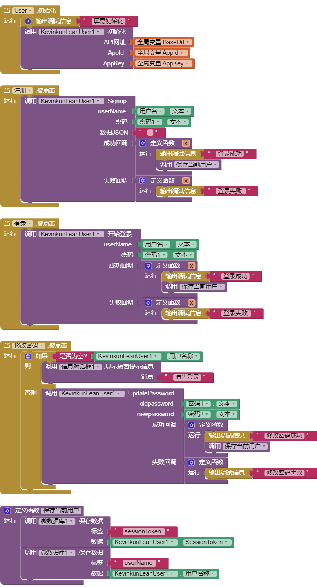
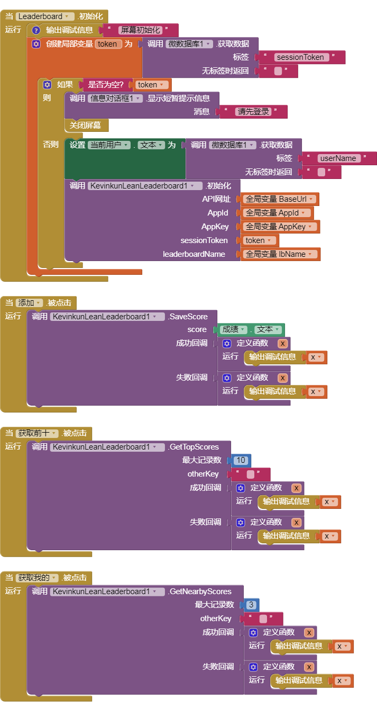
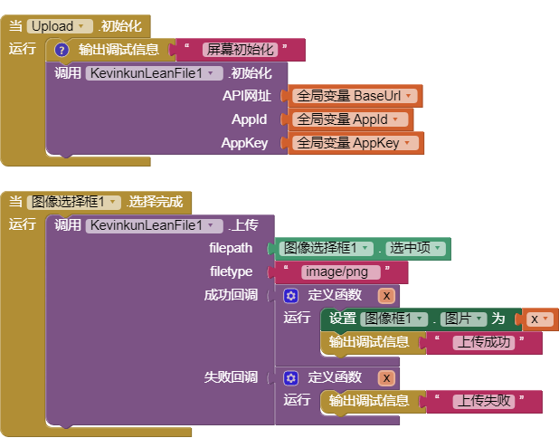
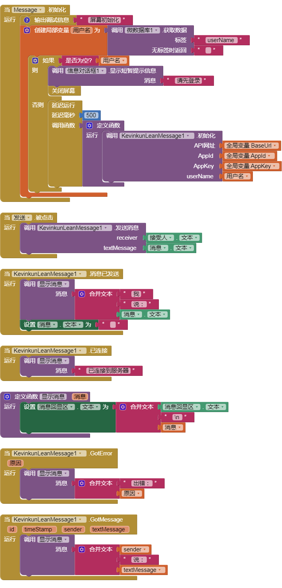
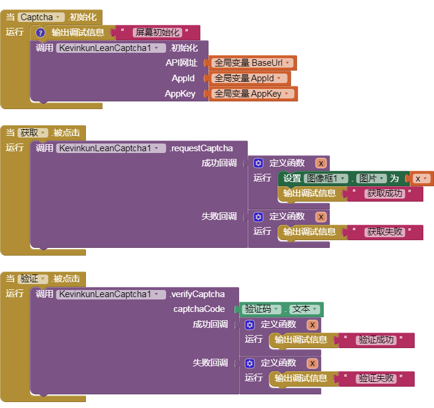

用LeanCloud作为后台，进行数据存储、用户管理、实时通讯等功能

<!--more-->

更少的代码，做更多的事。。。

# 简介

包含6个部分，分别是

| 组件名             | 中文    | 具体描述                                          |
| --------------- | ----- | --------------------------------------------- |
| LeanStorage     | 数据存储  | 添加、查询、更新、删除 （本组件已经[单独免费发布](leanstorage.html)） |
| LeanUser        | 用户管理  | 用户注册、登录、修改密码、重置密码等                            |
| LeanLeaderBoard | 排行榜功能 | 添加成绩、获取成绩、获取前10，获取我前后成绩等                      |
| LeanFile        | 上传文件  | 上传文件                                          |
| LeanCaptcha     | 图形验证码 | 获取和验证图形验证码                                    |
| LeanMessage     | 实时聊天  | 发送文消息、接受消息，获取历史消息。不只是聊天                       |

# 准备工作

1. 注册LeanCloud账号，网址是 [https://www.leancloud.cn](https://www.leancloud.cn)；
2. 可能需要实名认证；
3. 进入控制台，新建应用（相当于关系型数据库中的数据库）。；
4. 进入应用，点设置，点应用Keys，将右侧的Appid，AppKey，Rest Api服务器地址记下，初始化时用到；

# 代码示例

## LeanUser 用户管理

## LeanLeaderBoard 排行榜

需要配合LeanUser先注册用户，需要事先创建排行榜：

进入LeanCloud控制台，进入应用，点左边游戏，点排行榜下的数据，新建排行榜。按你的要求输入相关参数，完成创建。

排行榜参数：

1.名称，不解释

2.排序，你的排行榜按升序ascending还是 降序descending排列

3.更新策略，better（提交多次成绩只记录最好的），last（多次记录只记录最后提交的），sum（所有提交的记录相加。）

4.自动重置频率，每个相应的时间，排行榜就重置。可以设为从不重置。

## LeanFile 文件上传

仅支持Leancloud华北节点，限制10m以下文件。

## LeanMessage 实时通讯

这个初始化，不能直接在屏幕初始化中进行，需要延时一段时间比如500毫秒。

需要配合LeanUser先注册用户。

## LeanCaptcha 验证码

# 购买链接

付费，需要的请直接[qq或邮箱](mailto:wangsk789@qq.com)联系站长
