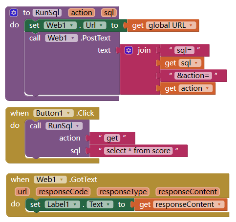

# 使用MySQL作为后端数据库

App Inventor 要连接MySQL数据库，一般是通过在服务器上部署一个php作为连接的接口，然后app inventor中使用http客户端连接接口，获取或发送数据。

<!--more-->

## 部署php文件

将以下内容的前几行中引号内文字修改为你的参数，保存为mysql.php文件，并上传到服务器。
请注意，此代码没有充分考虑安全性，请自行进行防注入等操作。

```php
<?php

$servername = "这里输入你的mysql地址"; //若php文件和mysql在同一服务器，可以写为localhost 或者 127.0.0.1
$username = "这里输入用户名";
$password = "这里输入密码";
$database = "这里输入数据库名";

if (isset($_REQUEST['sql'])){

    $con = mysqli_connect($servername,$username,$password,$database);
    if ($con){
        $sql =$_REQUEST['sql'];
        $sql =urldecode($sql);
        $startwith = strtolower(substr($sql,0,6));
        $actions = array("select", "insert","update","delete");
        if (in_array($startwith,$actions)){

            $result=mysqli_query($con,$sql);            
            if($result){
                $data =array();
                if($startwith =="select"){
                    $array = array();
                    $inum = 0;
                    while ($row=mysqli_fetch_assoc($result)){
                        $array[$inum]=$row;
                        $inum++;
                    }
                    $data['result'] = $array;
                }
                $data['affected'] = mysqli_affected_rows($con);
                if (isset($_REQUEST['action'])){
                    $data['action'] = $_REQUEST['action'];
                }
                $return = json_encode($data);
                header("HTTP/1.1 200 OK");
                echo $return;
            }
            else{
                header( "HTTP/1.1 400 Bad Request" );
                echo '{"error":"sql parse failed"}';
            }
        }else{
            header( "HTTP/1.1 400 Bad Request" );
                echo '{"error":"action not recognized"}';
        }
    }else{
        header("HTTP/1.1 500 Internal Server Error");
        echo '{"error":"connection failed"}';
    }
    mysqli_close($con);
}
else{
    header( "HTTP/1.1 400 Bad Request" );
    echo '{"error":"no sql specified"}';
}

?>
```

## 请求参数

请求接受两个参数，

- 一个是sql（必填），就是你要执行的sql语句（一次请求只能有一条sql语句）。为安全起见，以上代码只支持增改删查四项动作。
- 一个是action (可选)，如果你有多条sql要执行，就需要多次执行post请求，可以用此参数区别sql所执行的操作，他会在返回数据中原样返回，

## 请求方法

推荐post方法

## 返回结果

- 返回结果是json格式。类似于：

```
{
  "result": [
    {
      "id": "1",
      "xingming": "zhang san",
      "xingbie": "nan",
      "shuxue": "89",
      "yuwen": "68"
    }
  ],
  "affected": 1,
  "action": "get"
}
```

- 若有错误发生，返回值中会有error字段。
- 若没有错误，返回值中总会有affected字段，表明返回数据或者受到影响(添加或者修改或者删除)的数据条数。
- 若为select操作，返回值还包含result字段，包含所有返回记录的数组。

## 使用Web客户端与服务器交互



  [1]: /usr/uploads/2023/05/2116027381.png