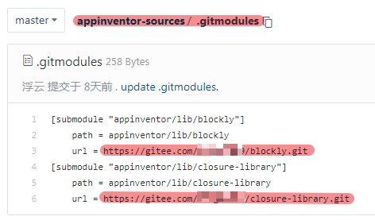

# 离线运行App Inventor

MIT的App Inventor 2服务器放在美国，国内连接慢，甚至出现可能连不上的情况。

使用离线版就可以愉快的在本地开发了。有能力的同学，甚至可以自己修改源码，打造自己的离线版本。

<!--more-->

本文以在Windows系统为例。

# 准备工作

首先准备以下软件并安装：

1. git

2. ant

3. openJDK

4. python

5. Google Cloud SDK

如果是自己找软件下载的话注意openjdk版本只要1.8版本就可以了，更高的话不支持。

注意下载完成后，要在环境变量中设置好路径(请百度搜索如何设置环境变量)。

以上软件我已经保存到这里，可以直接下载安装：

https://wwu.lanzout.com/b02unvsid
密码:5veg

# 下载源码

MIT App Inventor 2源码的官方仓库在这里：

https://github.com/mit-cml/appinventor-sources

国内连接非常慢，我们可以使用国内的gitee网站中转下。

这样以后我们如果对源码有修改，还可以push到gitee进行保存。

登录gitee.com，新建仓库，将上述源码从github导入仓库。

同样的方法，将这两个仓库fork到gitee：

https://github.com/mit-cml/blockly.git

https://github.com/mit-cml/closure-library.git

这两个是编译代码用到的子模块，也需要下载到本地。

修改gitee上appinventor-sources仓库的.gitmodules文件内的url为相应的gitee的网址：


资源管理器 打开D盘，空白地方右键，运行 git bush here

运行以下代码下载源码：

```
git clone https://gitee.com/你的用户名/appinventor-sources.git
```

运行以下代码下载子模块：

```
cd appinventor-sources
git submodule update --init
```

## 开始编译

双击运行appinventor-sources下面的buildtools.cmd，

1. 输入B，执行Doctor命令，查看编译源码需要的软件是否已经准备好；

2. 输入2，执行Make Auth Key命令；

3. 输入3，执行Build App Inventor命令；这步主要很长时间，最后会有提示说编译成功Success之类

## 开始开发

编译完成后，继续在buildtools.cmd运行界面 

1. 输入7，运行开发服务器，就可以在浏览器输入网址 http://localhost:8888/， 进行开发了。

点击Click Here to use your Google Account to login，然后随便输入个邮箱号，就可以进入系统。

2. 输入9，运行编译服务器 （如果你暂时不想编译成apk，可以先不执行这一步）

## 安装AI伴侣

编译成功后，在appinventor-sources\appinventor\build\buildserver下可以找到AI伴侣，将他安装到手机或者安卓模拟器内，就可以实时调试了。