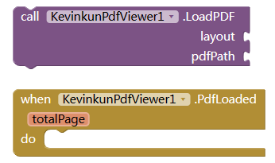
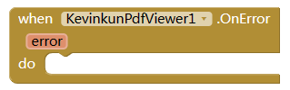
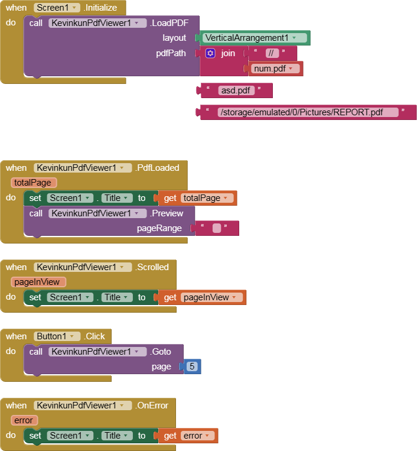

# PdfViewer Pdf文件查看

To view the pdf without opening 3th party app

<!--more-->

# ALL BLOCKS

## LoadPDF

LoadPDF function will fire PdfLoaded event if success, or OnError event if failed.

| parameter | type | description |
| -- | -- | -- |
| layou t| Arrangement | where the pdf file to show |
| pdfPath |String |path of the pdf file. start with // means from assets, start with /sdcard/ means from sdcard, start with no / means from ASD. |
| totalPage | Number |  pages of the pdf file |

## Preview

This needs to be called after PdfLoaded event. You can preview all pages or only partially.

| parameter | type   | description                                                                         |
| --------- | ------ | ----------------------------------------------------------------------------------- |
| pageRange | String | page range you want to show, like: **3**, or **1-10**, or **1,3,5**, or **1-5,7-9** |

## Goto

scroll to page you want to view.

| parameter | type | description |
| --- | --- | --- |
| page | Number | page you want to show |

## Scrolled

fired when the view is scrolled.

| parameter|type|description|
| -- | -- | -- |
|pageInView|Number|page now in view|

## OnError

|parameter|type|description|
|--|--|--|
|error|String|reason of error|

# SIMPLE DEMO

# FAQ

### How to view pdf online internet?

You need to download the pdf to local (like ASD) first.

# DOWNLOAD LINK

[cn.kevinkun.PdfViewer.aix](./images/20250303_123238.aix)
