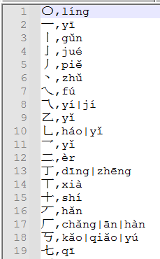
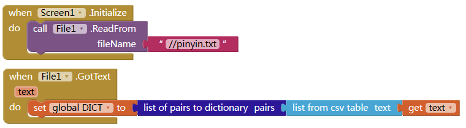
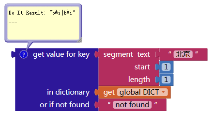
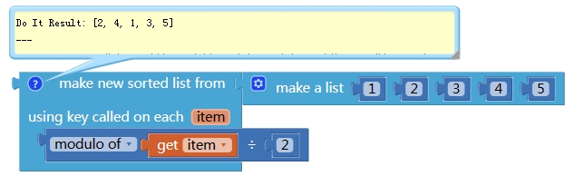
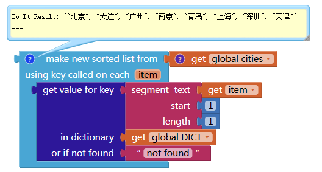
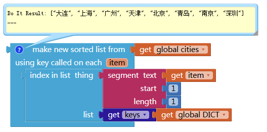

# 将汉字按照拼音排序

<!--more-->

群里有人提出如何将城市名称按照拼音排序，这里是一个解决方案：查字典法。就是我们提前准备（几乎）所有汉字和拼音的字典，使用AI2提供的排序块排序列表。

# 准备工作

这里我准备了一个字典文件（[pinyin.txt](./images/20250303_123755.txt)），请右键另存到本地，文件来源 https://gitee.com/liqiangit/jpinyin ， 我把内容格式改为了csv格式，并按照笔画顺序排序了。
字典包含了20903个汉字。

文件格式为

# 加载字典

将上面的字典文件导入项目的素材库中。
我们使用文件管理器读取文件。
读取后将格式转为字典格式。

这样，我们就可以查字典，找到某个汉字的拼音了：

注意这个字典只能查询单个汉字的拼音，如果需要转换多个汉字，需要用循环转换后拼接字串而成。
有些汉字可能有多个读音，这里多个拼音用|进行了分隔。

# 按映射值排序列表块

在新版的AI2中，引入了多个对列表进行操作的块，其中一个是使用列表项映射的值进行排序：

他的作用是，将列表项转换为一个相应的值，按照这个新的值进行排序，但是返回的是原列表的内容。
比如：

这里，他会把所有数字都除以2求余数，按照余数的大小排序，然后返回每个余数对应的原来的数的列表。

# 按拼音排序

这里我们将列表项转为拼音，然后让他按照拼音排序，然后返回的还是汉字。

假设我们有一个城市列表：

我们要对这个列表按照拼音顺序排序。

这样，就得到了按照城市名第一个字的拼音排序的列表。

# 按笔画排序

上面我已经说过，这个字典文件，我已经按照笔画顺序排序了，所以只要找到汉字所在位置的索引，比较索引就可以按笔画顺序排序了。

# 一点小bug

实际测试会发现有时候“啊”这个读音的会排在最后面，这是因为这个字典文件的拼音字母使用的是āáǎàōóǒòēéěèīíǐìūúǔù 这种元音，这些跟abcde这种进行排序是会排在后面的。
解决办法就是替换字典中的这种带读音的元音符号。
请根据情况使用以下一种替换。

[pinyin.without.tone.txt](./images/20250303_123719.txt)

[pinyin.with.number.tone.txt](./images/20250303_123737.txt)
