# 俄罗斯方块

MAKE TETRIX GAME FROM SCRATCH IN APP INVENTOR 2

<!--more-->

## ## Designer view

In Designer view we add 

1. one Canvas, with width 240 and height 480.
2. six Buttons, for StartGame, MoveLeft, MoveRight, RotateCounterClockwise, RotateClockwise, RapidDrop
3. one Clock, set the TimerEnabled to false, set Interval to 200
4. one Notifier component
5. one Web component

## Board grid

We will divide our canvas into 20 x 10 small grids. Each grid has width 24 and height 24. Each combination will occupy 4 grids.
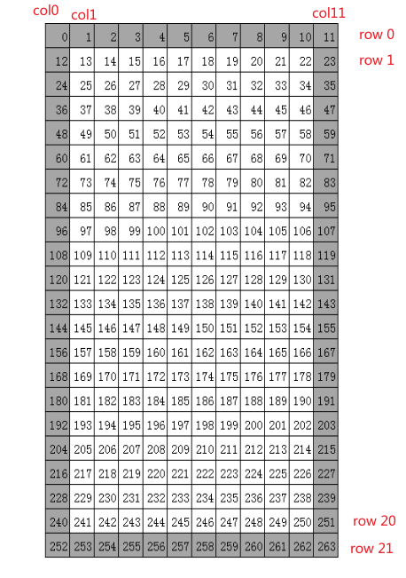

The white grids are on our canvas, the gray ones are the out edge of the canvas, the combinations can not go to the gray grids.

We initialize our board data, we fill the gray ones with 9, white one with 0. Later, if the grid is occupied, we will modify this board_data with color index.

```
9,9,9,9,9,9,9,9,9,9,9,9,
9,0,0,0,0,0,0,0,0,0,0,9,
9,0,0,0,0,0,0,0,0,0,0,9,
9,0,0,0,0,0,0,0,0,0,0,9,
9,0,0,0,0,0,0,0,0,0,0,9,
9,0,0,0,0,0,0,0,0,0,0,9,
9,0,0,0,0,0,0,0,0,0,0,9,
9,0,0,0,0,0,0,0,0,0,0,9,
9,0,0,0,0,0,0,0,0,0,0,9,
9,0,0,0,0,0,0,0,0,0,0,9,
9,0,0,0,0,0,0,0,0,0,0,9,
9,0,0,0,0,0,0,0,0,0,0,9,
9,0,0,0,0,0,0,0,0,0,0,9,
9,0,0,0,0,0,0,0,0,0,0,9,
9,0,0,0,0,0,0,0,0,0,0,9,
9,0,0,0,0,0,0,0,0,0,0,9,
9,0,0,0,0,0,0,0,0,0,0,9,
9,0,0,0,0,0,0,0,0,0,0,9,
9,0,0,0,0,0,0,0,0,0,0,9,
9,0,0,0,0,0,0,0,0,0,0,9,
9,0,0,0,0,0,0,0,0,0,0,9,
9,9,9,9,9,9,9,9,9,9,9,9
```

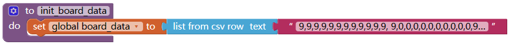

the board_data is a one-dimension list.

## Draw one piece on Canvas

We need a procedure to convert location to row/col.
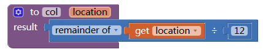
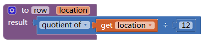

Initialize variable COLORS for all the combination colors.
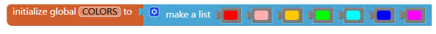

To draw one small piece:
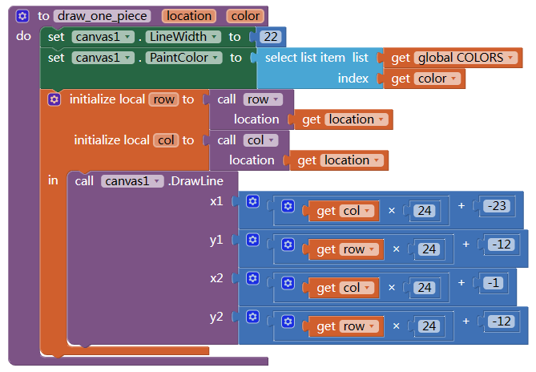

The girds with width 24 and height 24, but we draw the piece with only 22 x 22, that will make a gap between the pieces.

Now,it's time to test our code:
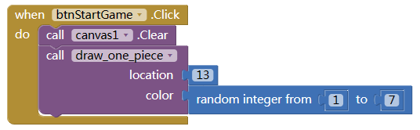

if a small piece drawn on the top left corner of the canvas, it means our code is good.

Change 13 to 250  to see if it's at bottom left corner.

## Combinations and shapes

In Tetrix game, there are total 7 types of combinations, each has 4 small pieces. 

Each combination can rotate 0/90/180/270 degree, that makes total 4 shapes of each combination.

We calculate the location difference between each piece to its top left location as the offset.

We take type L for example.
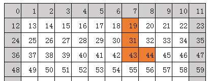

If we put at 19 (top left corner), this combination will occupy location 19, 31, 43, and 44. the offset to 19 is 0,12,24,25.

Then we rotate it 90 degree counter clockwise, 
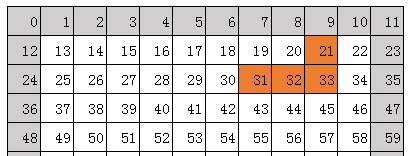

Now the offset became 2,12,13,14.

This offset is only determined by combination type and rotate, has nothing to do with its location.

For example, we move the combination 2 grids  left:
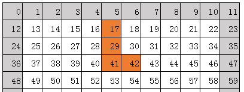

Now the top left at 17, but  offset still is 0,12,24,25.

The complete offset table:
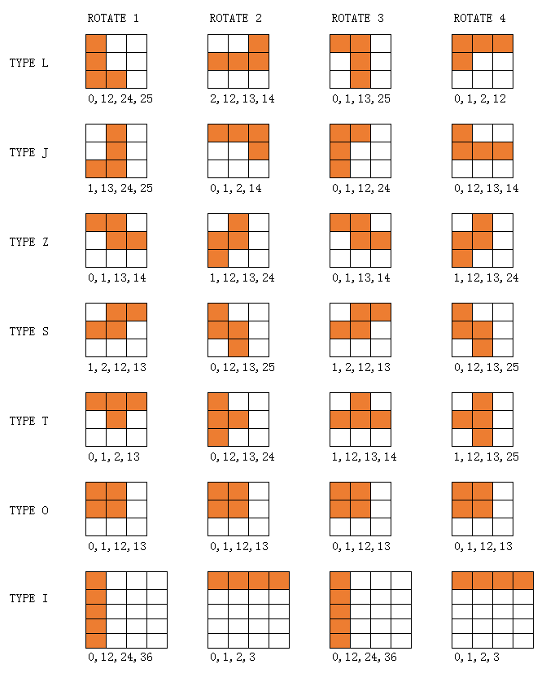

With this method, we record all the offset of all combination and rotate. Some offsets of combination (type O and type I) is same when different rotate. 

```
[
    [
        [0,12,24,25],[2,12,13,14],[0,1,13,25],[0,1,2,12]
    ],[
        [1,13,24,25],[0,1,2,14],[0,1,12,24],[0,12,13,14]
    ],[
        [0,1,13,14],[1,12,13,24],[0,1,13,14],[1,12,13,24]
    ],[
        [1,2,12,13],[0,12,13,25],[1,2,12,13],[0,12,13,25]
    ],[
        [0,1,2,13],[0,12,13,24],[1,12,13,14],[1,12,13,25]
    ],[
        [0,1,12,13],[0,1,12,13],[0,1,12,13],[0,1,12,13]
    ],[
        [0,12,24,36],[0,1,2,3],[0,12,24,36],[0,1,2,3]
     ]
]
```

![2023-05-10T05:48:51.png][12]

## Draw a combination

Now we can generate a random combination and draw it on the canvas.

We need some variable to record current combination's state: top left, rotate, type, and offset.
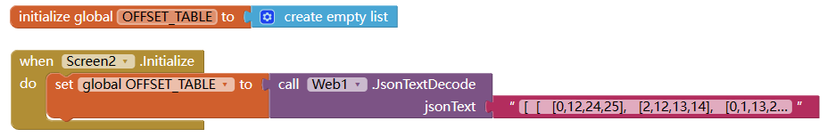
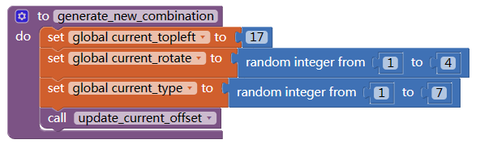

17 is the center of the first row. the current offset can be looked up in the OFFSET TABLE.
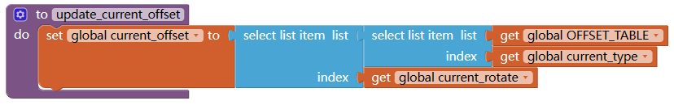

According to the top left and offset, we can calculate location of each piece, then draw them one by one.
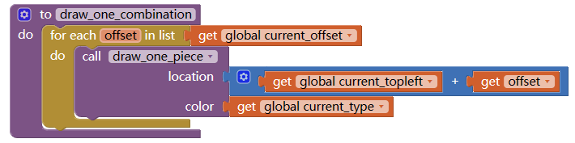

Now, time to test our code:
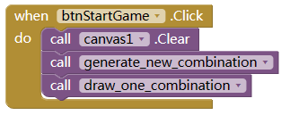

You will see random combination (with different type and rotate) show up on top of the canvas when press Start Game button.

## Move the combination

Now to manipulate a combination is very easy, we just need to change its top left, or its rotate, then redraw it. 

To move left, we minus 1 from Top left location. 

To right, add 1 to Top left location. 

To move down, we add 12 to Top left location. 

To rotate it counter clockwise, just add 1 to current rotate.

To rotate it clockwise, minus 1 from current rotate

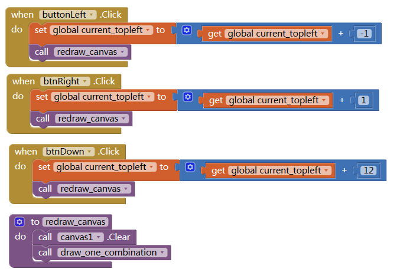
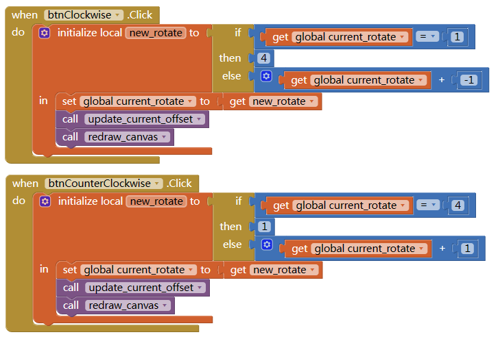
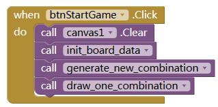

Don't forget to update the current offset after change rotate. and initialize the board data when start game.

Now test the code, you will find the combination is moving /rotating.

## Restrain the combination on canvas

But it will move out of the canvas, which need to be  avoided:

First we need to check if a grid/location is empty:

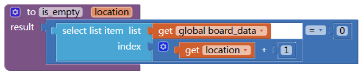

(Why we need to add 1 to location?)

Then check if all the destination locations are empty:
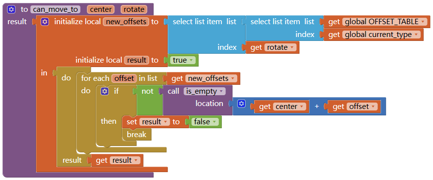

Modify the button click event:
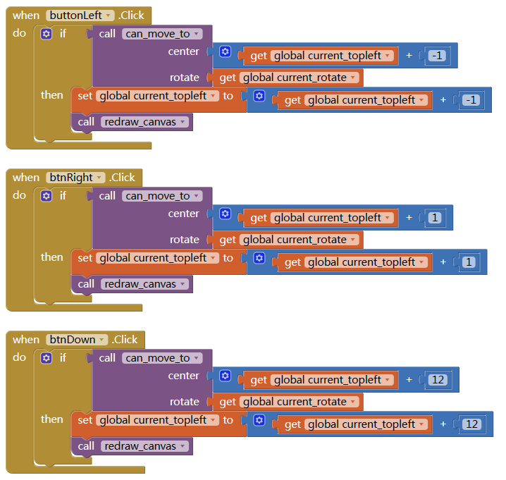
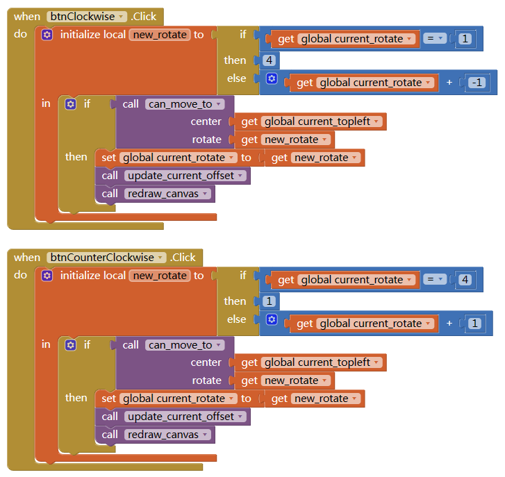

You can change the IF block in btnDown.Click event to WHILE TEST block, this will bring down the combination to bottom directly.

Now test your code, if the combination can be moved outside the canvas?

## Combination move down automatically

It's time to let the combination move down by itself:
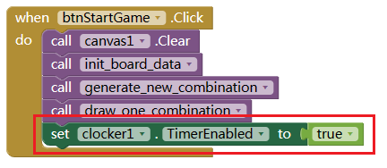

When clocker timer fires, we try to move the combination down. if not possible (reach bottom or blocked by other combinations), we regenerate a new one.
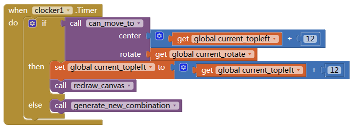

Now press Start game, your combination will falling down by it self. BUT the combination do not stay at bottom. 

## Add combination to canvas

When combination reach bottom, add locations occupied by the combination to the board data.
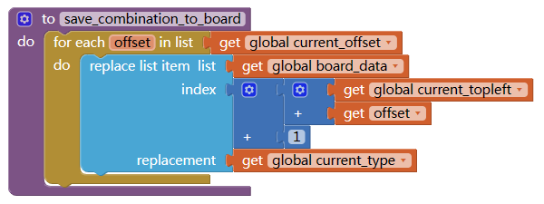

And we need to draw the board data on canvas:
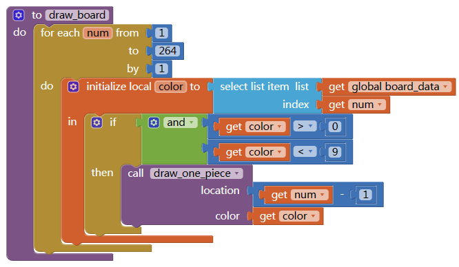
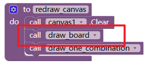
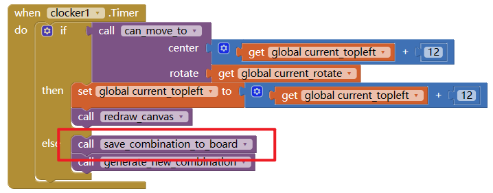

Don't forget to test your code here.

## Check game over

now we can move the combination left/right/down, rotate, and falling down automatically.

So when will the game over? we can set game over if the new generated combination can not be placed at location 17. If game over, disable the timer, that will stop everything.
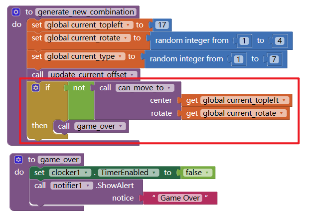

Start game, and do nothing, wait until you see the game over alert.

## Remove fill-up rows

Now the last important step.

When the combination reach bottom or other combinations, before generate a new combination, we need to check if any rows can be removed.

We will only need to check the rows where the combination is at.
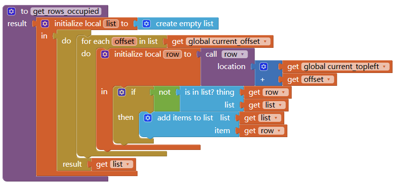

Then we check one by one if it's removable. If any one piece is empty, the answer is no.
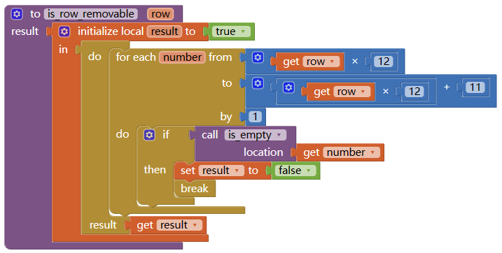

If possible, we remove the row and add a new row.
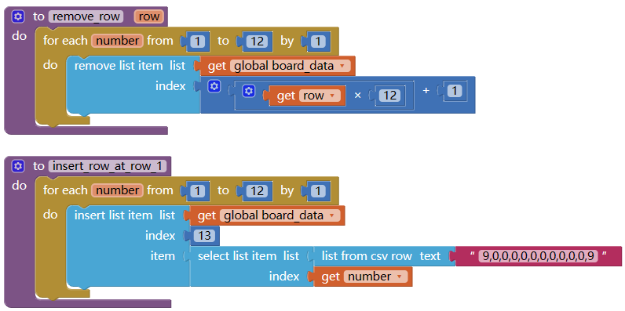
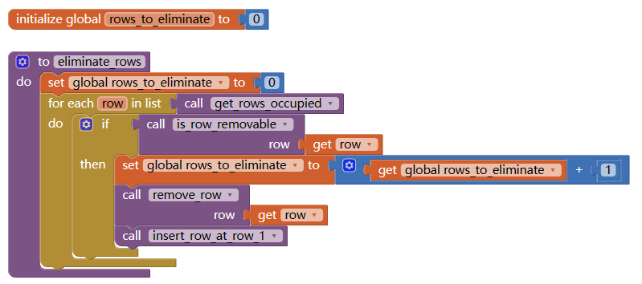

Modify the clock.Timer event
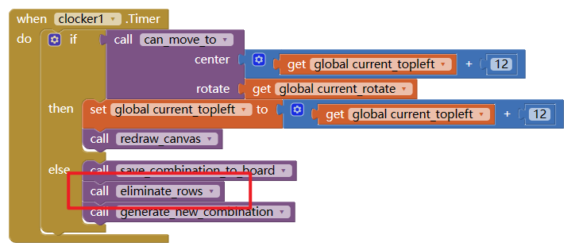

Now all the main function finished.

## OTHER

Next you can add some other functions like update score, show preview of next combination, better UI.

Have fun and keep coding...