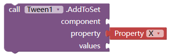
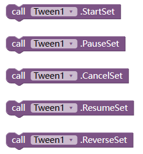
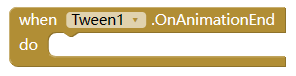
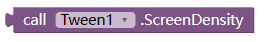
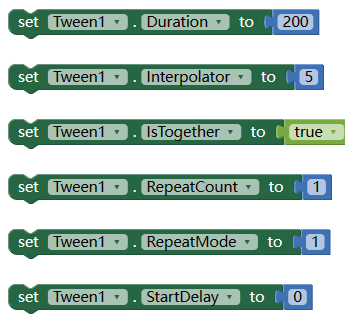

# 补间动画扩展

补间动画是一个概念，允许你以平滑的方式更改对象的属性。你只需告诉它哪些属性要更改，当补间结束运行时它们应该具有哪些最终值，以及这需要多长时间，补间引擎将负责计算从起始点到结束点的值。

<!--more-->

就是说：指定动画持续的时间，开始状态和结束状态。扩展就可以（根据插值器）自动计算中间的状态，生成动画。

## 目前的问题：

不支持画布、图像精灵、球形精灵。

# WHAT'S A TWEEN

A tween (from [*in-between*](http://en.wikipedia.org/wiki/Inbetweening)) is a concept that allows you to change the values of the properties of an object in a smooth way. You just tell it which properties you want to change, which final values should they have when the tween finishes running, and how long should this take, and the tweening engine will take care of finding the intermediate values from the starting to the ending point. (from http://tweenjs.github.io/tween.js/docs/user_guide.html) 

# BLOCKS

## Add a animator to a set.

this can be used to add animator on same component with defferent properties, or same properties of defferent componnet, event can use to tween color(backgroundColor, textColor)
|param | type | description|
|--- | --- | ---|
| component | visible component | NOT working with ImageSprites or Balls. 任何可见组件，但不包含图像精灵和球形精灵。 |
| property | string |including but not limited to X, Y, TranslationX, TranslationY, ScaleX, ScaleY, RotationX, RotationY, RotationZ, BackgroundColor, TextColor, only if the property value is a number 可以更改的属性名。 |
| values| list |if length is 1, that means from this property's current value to this number. if length >= 2, that means, from 1st number to 2nd, to 3rd  若列表长度为1，表示从原来的属性值变为这个值。若长度大于2， 表示从第一个值变为第二个值，然后变为第三个... |

## Start/Pause/Cancel/Resume/Reverse set

开始、取消、暂停、恢复、反转动画。

## Animation End event

动画完成事件

## ScreenDensity

屏幕分辨率

useful when you tween the x/y/translationX/translationY
在tween位置或者大小时有用。

## Properties

| name         | type    | desc                                                                                                                                                                          |
| ------------ | ------- | ----------------------------------------------------------------------------------------------------------------------------------------------------------------------------- |
| Duration     | int     | how long the animation last, in millis, default 500 动画持续的时间                                                                                                                |
| Interpolator | int     | animation type. :1.AccelerateDecelerate, 2.Accelerate,3.Decelerate,4.Bounce, 5.Linear, 6.AnticipateOvershoot, 7.Anticipate, 8.Overshoot  动画的类型，比如加速、减速、匀速等。可以自己试验下。默认是5 匀速 |
| IsTogether   | boolean | true for play together, false for play one by one.  如果有多个动画，是否同时播放还是依次播放                                                                                                   |
| RepeatCount  | int     | number to repeat the animation. -1 for infinity 动画重复次数。-1表示无限重复。默认为0表示不重复                                                                                                  |
| RepeatMode   | int     | 1 for restart, 2 for reverse 重复模式。1-从新开始 2-倒叙播放                                                                                                                            |
| StartDelay   | int     | how many millis to delay the animation 动画延迟多久后才开始。单位毫秒                                                                                                                     |

# DOWNLOAD LINK:

下载链接
AIX:
[cn.kevinkun.Tween.v4.aix](./images/20250303_132642.aix)

# Demo

示例 侧边栏动画
[sidebar.aia](./images/20250303_132702.aia)
其中使用了层叠布局扩展，thanks to @VSATISH13。
in this demo, [extension Overlap by VSATISH13](27540) used .
